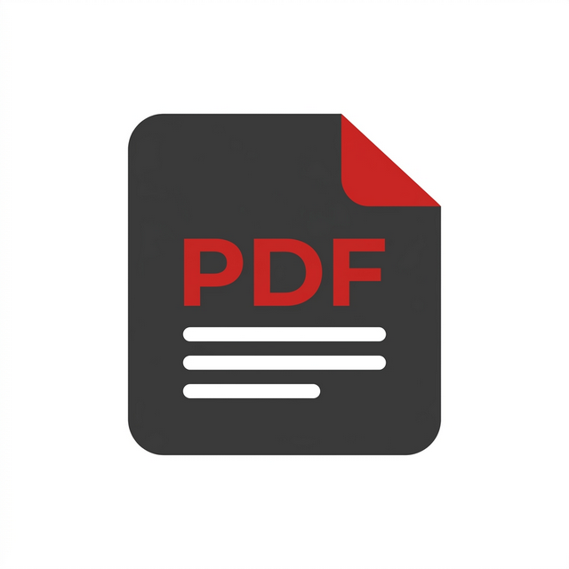

# PDF Tools - Manipulación de PDF Profesional



Una aplicación web moderna y segura diseñada para manipular archivos PDF de forma rápida y sencilla directamente desde tu navegador.

## 🚀 Características Principales

### Módulos Actuales
- **🔗 Unir PDFs**: Combina varios archivos PDF en un solo documento. Reordena tus archivos fácilmente antes de unirlos.
- **🔄 Rotar Páginas**: Corrige la orientación de tus documentos rotando páginas en ángulos de 90°, 180° o 270°.
- **📑 Extraer Páginas**: Selecciona y extrae páginas específicas de un PDF para crear un nuevo documento.
- **🗑️ Eliminar Páginas**: Remueve páginas innecesarias de tus archivos PDF con una vista previa visual.
- **🔢 Paginar**: Añade numeración de páginas personalizable en posición, formato y tamaño de fuente.

- **🖼️ Imágenes a PDF**: Convierte una o varias imágenes (JPG, PNG, WEBP, GIF, BMP) en un documento PDF. Soporta reordenamiento visual con drag & drop antes de convertir.
- **🔀 Reorganizar Páginas**: Reordena las páginas de un PDF mediante drag & drop visual con miniaturas. Ideal para corregir el orden tras un merge incorrecto.

### Módulos Próximos (En Desarrollo)
- **📄 Word a PDF** _(Sprint 2)_: Convierte documentos .docx a PDF directamente desde el navegador.
- **📄 PDF a Word** _(Sprint 2)_: Extrae el contenido de un PDF a formato .docx editable.

### Siempre Presente
- **🔒 Privacidad Garantizada**: El procesamiento se realiza de forma temporal y segura. Los archivos no se almacenan permanentemente en el servidor.
- **📱 Diseño Responsivo**: Interfaz moderna y adaptable a cualquier dispositivo.

## 🛠️ Tecnologías Utilizadas

### Backend
- **Python 3.x**
- **Flask**: Framework web ligero y potente.
- **PyPDF2**: Biblioteca para manipulación de PDFs.
- **ReportLab**: Generación y superposición de contenido PDF (paginación).
- **Pillow**: Conversión de imágenes a PDF _(próximamente)_.
- **pdf2docx / python-docx**: Conversión Word ↔ PDF _(próximamente)_.
- **Flask-Limiter**: Seguridad mediante limitación de peticiones.
- **Gunicorn**: Servidor HTTP WSGI para producción.

### Frontend
- **HTML5 & CSS3**: Diseño personalizado con un sistema de diseño moderno.
- **JavaScript (Vanilla)**: Lógica interactiva y manejo de archivos.
- **PDF.js**: Renderizado de vistas previas de PDF en el navegador.
- **SortableJS**: Drag & drop para reorganización de páginas _(próximamente)_.

## 📦 Instalación y Uso Local

1. **Clonar el repositorio:**
   ```bash
   git clone <url-del-repositorio>
   cd pdfApp
   ```

2. **Crear un entorno virtual (opcional pero recomendado):**
   ```bash
   python -m venv venv
   source venv/bin/activate  # En Windows: venv\Scripts\activate
   ```

3. **Instalar dependencias:**
   ```bash
   pip install -r requirements.txt
   ```

4. **Ejecutar la aplicación:**
   ```bash
   python app.py
   ```
   La aplicación estará disponible en `http://127.0.0.1:5000`.

## 🌐 Despliegue

El proyecto está configurado para ser desplegado fácilmente en plataformas como **Render** o **Heroku** utilizando el archivo `Procfile` incluido:
```text
web: gunicorn app:app
```

## 📄 Licencia

Este proyecto es de código abierto y está disponible bajo la licencia MIT.

---

Desarrollado con ❤️ para simplificar la gestión de documentos PDF.
